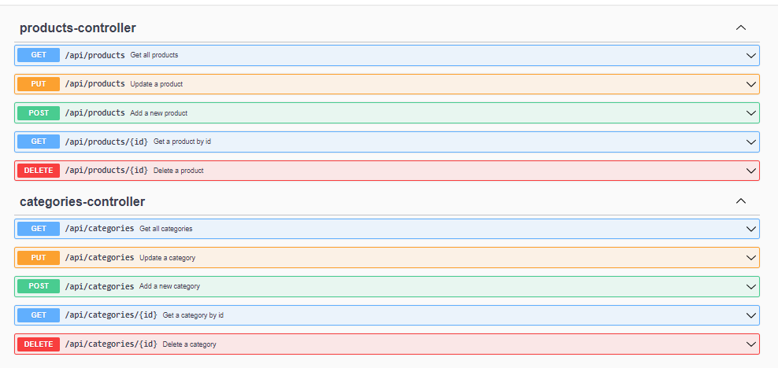
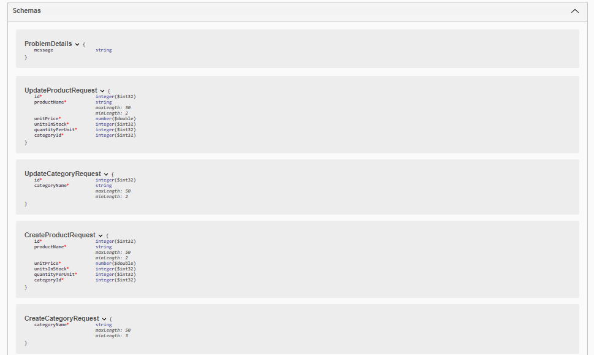
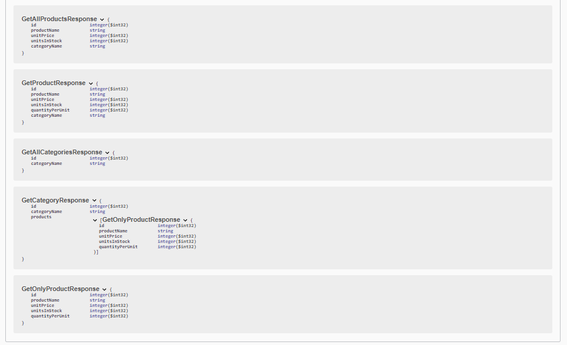

# Getting Started
### About Project
- Bu proje Spring Boot ile yazılmıştır.
- Proje PostgreSQL veri tabanı kullanmaktadır.
- Proje Swagger ve Postman vb arayüzler ile test edilebilir.
- Proje Spring Data JPA kullanmaktadır.
- Entity, Data Access, Business, Controller katmanları kullanılmıştır.
- Proje Lombok kullanmaktadır.
- ModelMapper kullanarak Request ve Response DTO'ları ile Entity arasında mapleme işlemi yapılmıştır.
- Exception Handling yapılmıştır.

### Requirements
- PostgreSQL için PgAdmin4 kurulumu yapılmalıdır. https://www.postgresql.org/download/
- PostgreSQL için bir veri tabanı oluşturulmalıdır.
- Lomok eklentisi için IDE'nize Lombok eklentisini kurmalısınız. https://projectlombok.org/setup/overview
- application.properties dosyasında veri tabanı adı, kullanıcı adı ve şifre configure edilmelidir. 
- Main class'ı başlatın depedenciesler otomatik olarak indirilecektir. 
- http://localhost:8080/swagger-ui.html adresine gidin
- Swagger arayüzünden tüm isteklerinizi gönderebilir responsları görebilirsiniz.
- Product eklemek için ilk önce Category eklemeniz gerekmektedir. Category ekledikten sonra categoryId fieldını doldurup Product ekleyebilirsiniz.
#### Postman aracılığıyla da isteklerinizi göndermek için şu endpointi kullanabilirsiniz. 
###### Product için:
- http://localhost:8080/api/products 
- GET isteği atarsanız tüm productları getirir.
- http://localhost:8080/api/products/{id} GET isteği atarsanız id'si verilen product'ı getirir.
- POST isteği atarsanız yeni bir product ekler. Body kısmına:
- {
  "id": 0,
  "productName": "string",
  "unitPrice": 0,
  "unitsInStock": 0,
  "quantityPerUnit": 0,
  "categoryId": 0
  }
- şeklinde bir json verisi göndermelisiniz.
- PUT isteği atarsanız id'si verilen product'ı günceller. Body kısmına:
- {
  "id": 0,
  "productName": "string",
  "unitPrice": 0,
  "unitsInStock": 0,
  "quantityPerUnit": 0,
  "categoryId": 0
  }
- şeklinde bir json verisi göndermelisiniz.
- http://localhost:8080/api/products/{id} DELETE isteğini id yazan kısıma id değerini girerek productu silebilirsiniz 
###### Category için:
- http://localhost:8080/api/categories
- GET isteği atarsanız tüm categoryleri getirir.
- http://localhost:8080/api/categories/{id} GET isteği atarsanız id'si verilen category'yi getirir.
- POST isteği atarsanız yeni bir category ekler. Body kısmına:
- {
  "categoryName": "string"
  }
- şeklinde bir json verisi göndermelisiniz.
- PUT isteği atarsanız id'si verilen category'yi günceller. Body kısmına:
- {
  "id": 0,
  "categoryName": "string"
  }
- şeklinde bir json verisi göndermelisiniz.
- http://localhost:8080/api/categories/{id} DELETE isteğini id yazan kısıma id değerini girerek categoryyi silebilirsiniz
    
### Swagger UI endpointleri

### Şemalar

