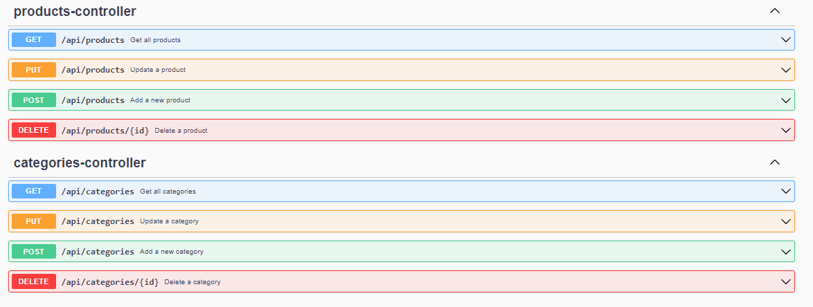
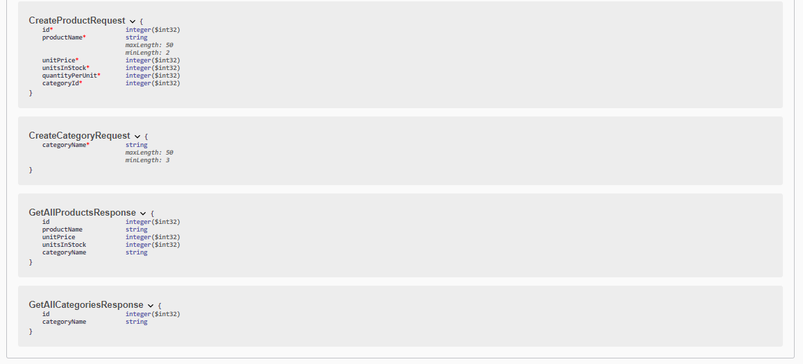

# Getting Started

### Requirements
- PostgreSQL için PgAdmin4 kurulumu yapılmalıdır. https://www.postgresql.org/download/
- PostgreSQL için bir veri tabanı oluşturulmalıdır.
- application.properties dosyasında veri tabanı adı, kullanıcı adı ve şifre configure edilmelidir. 
- Main class'ı başlatın depedenciesleri otomatik olarak indirilecektir. 
- http://localhost:8080/swagger-ui.html adresine gidin 
- Swagger arayüzünden tüm isteklerinizi gönderebilir responsları görebilirsiniz.
#### Postman aracılığıyla da isteklerinizi göndermek için şu endpointi kullanabilirsiniz. 
###### Product için:
- http://localhost:8080/api/products 
- GET isteği atarsanız tüm productları getirir.
- POST isteği atarsanız yeni bir product ekler. Body kısmına:
- {
  "id": 0,
  "productName": "string",
  "unitPrice": 0,
  "unitsInStock": 0,
  "quantityPerUnit": 0,
  "categoryId": 0
  }
- şeklinde bir json verisi göndermelisiniz.
- PUT isteği atarsanız id'si verilen product'ı günceller. Body kısmına:
- {
  "id": 0,
  "productName": "string",
  "unitPrice": 0,
  "unitsInStock": 0,
  "quantityPerUnit": 0,
  "categoryId": 0
  }
- şeklinde bir json verisi göndermelisiniz.
- http://localhost:8080/api/products/{id} DELETE isteğini id yazan kısıma id değerini girerek productu silebilirsiniz 
###### Category için:
- http://localhost:8080/api/categories
- GET isteği atarsanız tüm categoryleri getirir.
- POST isteği atarsanız yeni bir category ekler. Body kısmına:
- {
  "categoryName": "string"
  }
- şeklinde bir json verisi göndermelisiniz.
- PUT isteği atarsanız id'si verilen category'yi günceller. Body kısmına:
- {
  "id": 0,
  "categoryName": "string"
  }
- şeklinde bir json verisi göndermelisiniz.
- http://localhost:8080/api/categories/{id} DELETE isteğini id yazan kısıma id değerini girerek categoryyi silebilirsiniz
    
### Swagger UI endpointleri

### Şemalar

